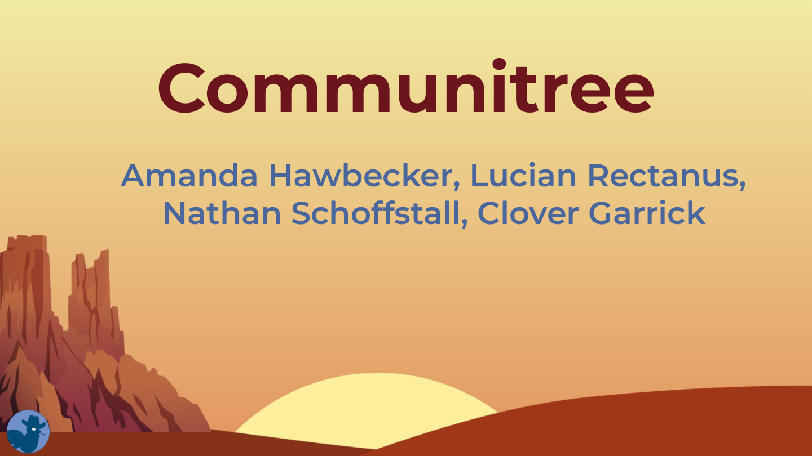
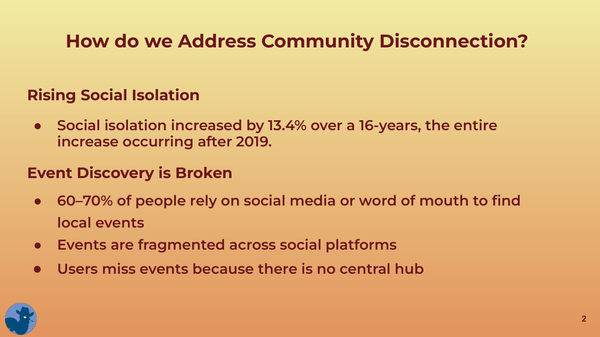
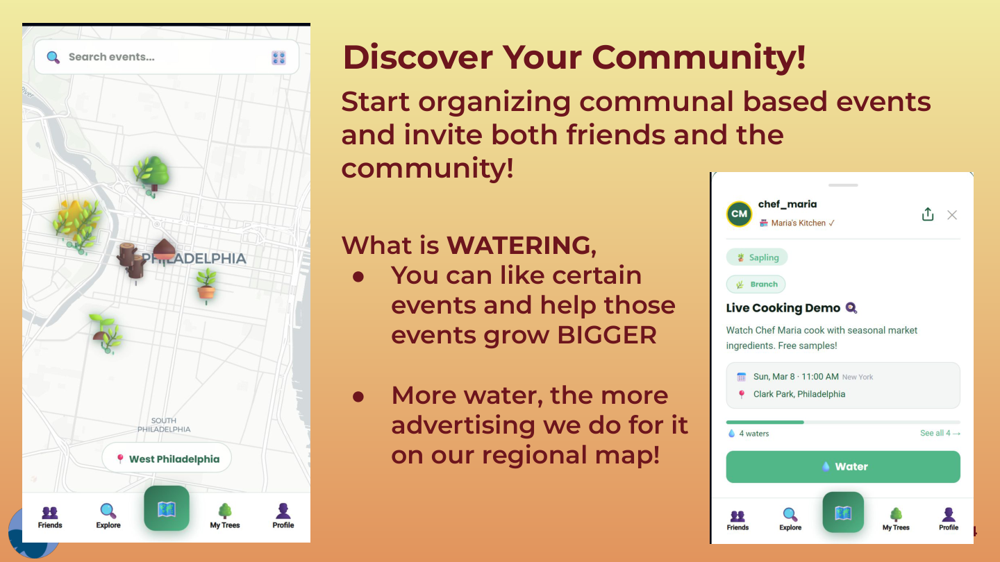
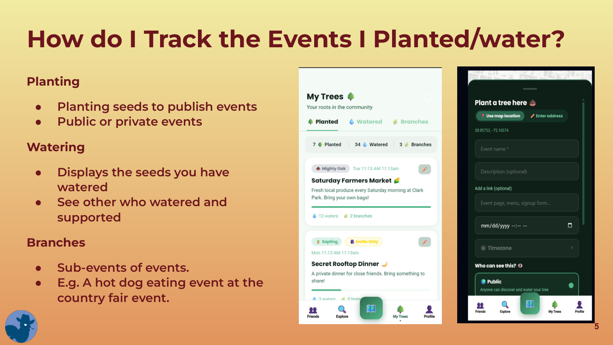
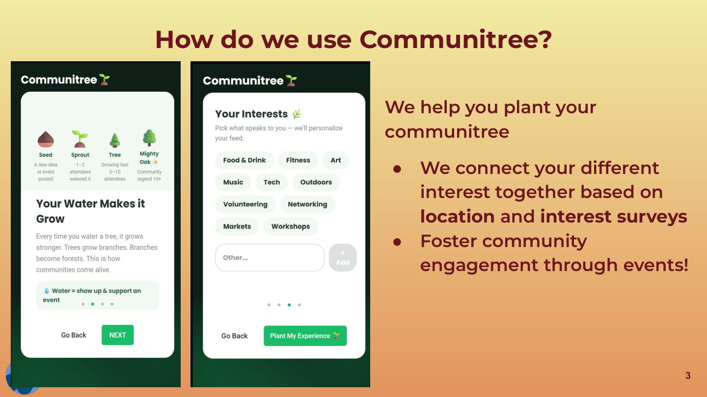
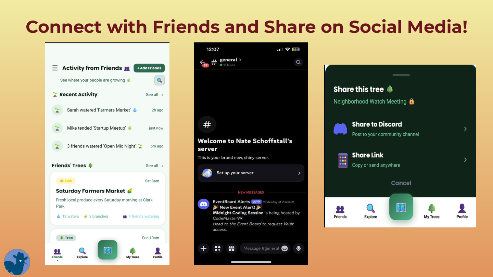
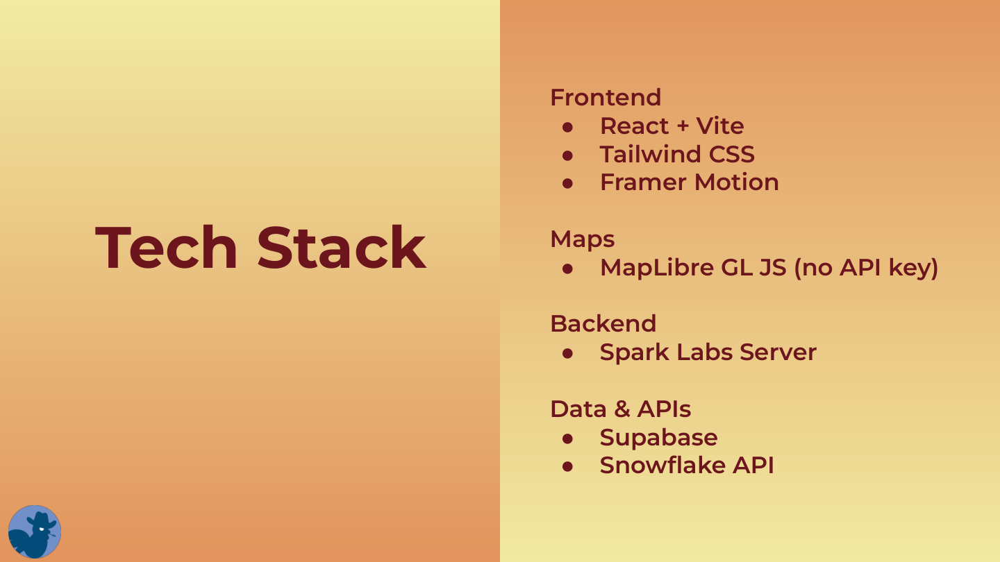
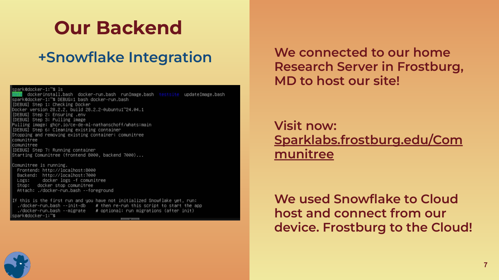

# How Roots Works

Roots is a hyperlocal community platform where neighbors discover events on a living map. Posts appear as seeds and grow into trees as people engage — no DMs, all interaction is public or group-based.

---

## The Problem We're Solving

Social isolation has risen sharply since 2019. 60–70% of people rely on social media or word of mouth to find local events, which are fragmented across platforms with no central hub.

---

## The Living Map

Every event or gathering posted in your neighborhood appears as a node on the map. That node starts as a **seed** and evolves based on community engagement (waters, joins, attends).

### Growth Stages

| Stage | Interactions | Visual |
|-------|-------------|--------|
| Seed | 0 | Small grey dot |
| Sprout | 1–2 | Green pulse |
| Sapling | 3–5 | Green glow |
| Tree | 6–10 | Full green node |
| Ancient Oak | 10+ recurring | Gold beacon |

As more people engage, the node grows larger and brighter in real time — powered by Supabase real-time subscriptions.

---

## Planting a Tree

Anyone can plant a tree (create an event) by tapping the map. You fill in:

- **Event name** (required)
- **Description** and optional link
- **Date, time, and timezone**
- **Location** — use your dropped map pin or type an address
- **Pricing** — Free or Paid (with ticket price)
- **Privacy** — Public, Private Group, or Invite Only

Once planted, the seed appears on the map for your neighborhood.

---

## Branching

When a tree has enough engagement, community members can **create a branch** — a related sub-event that spawns off the original. Branches appear near their parent on the map, connected by a dashed line, and follow the same growth stages.

---

## Watering

"Watering" is how you show interest or support for an event. Each water nudges the post closer to the next growth stage. At 12 waters, a tree can become an **Ancient Oak** — the highest community recognition.

---

## Privacy

| Mode | Visibility |
|------|-----------|
| Public | Anyone can discover and engage |
| Private Group | Visible on map; people request to join |
| Invite Only | Hidden from map; only invited people see it |

---

## Getting Started

When you first join, Roots connects your interests and location to surface the most relevant events in your neighborhood — fostering community engagement from day one.

---

## Neighborhood Personality

Each neighborhood is assigned a weekly personality label (e.g., "The Artsy Block", "The Foodies") generated by Claude AI based on the types of events trending that week.

---

## AI Moderation

Every post is screened by Google Gemini before appearing on the map to ensure community safety and relevance.

---

## Cross-Posting & Friends

Public events can be cross-posted to Discord automatically via webhook, so communities that already exist on Discord stay in the loop. You can also follow friends and see their activity in your feed.

---

## Tech Stack

| Layer | Technology |
|-------|-----------|
| Frontend | React + Vite + Tailwind CSS + Framer Motion |
| Map | MapLibre GL JS + @vis.gl/react-maplibre |
| Backend | Python FastAPI (hosted on Spark Labs / Frostburg Research Server) |
| Database | Supabase (PostgreSQL + real-time + auth) |
| Cloud | Snowflake API |
| AI Assistant | Claude API (Anthropic) |
| AI Moderation | Google Gemini API |
| Deploy | Vercel (frontend) + Spark Labs Server (backend) |

---

## No DMs — Ever

Roots is intentionally public. All interaction happens on posts, in groups, or at events. There is no direct messaging feature by design — the goal is to build community in the open.
